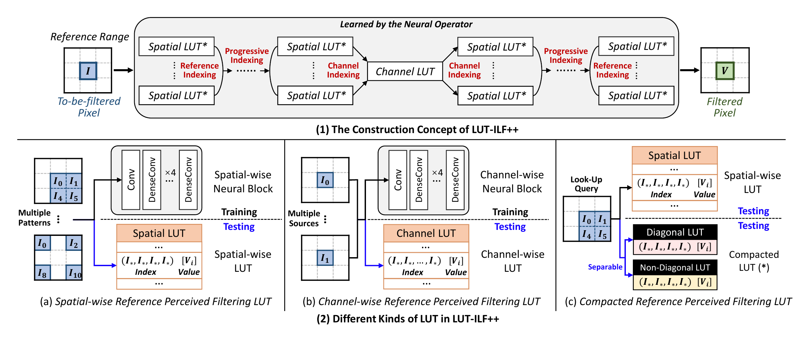

<h1 align="center">LUT-ILF++</h1>

<h3 align="center">Learned Look-Up Tables for Practical In-Loop Filtering in Video Coding</h3>

<p align="center">
  <strong>LUT-family from the
  <a href="https://ustc-ivclab.github.io/">USTC iVC Lab</a></strong>
</p>
<p align="center">
  Zhuoyuan Li &nbsp;·&nbsp; Jiacheng Li &nbsp;·&nbsp; Yao Li &nbsp;·&nbsp;
  Jialin Li &nbsp;·&nbsp; Li Li &nbsp;·&nbsp; Dong Liu* (corresponding author) &nbsp;·&nbsp; Feng Wu
</p>

<p align="center">
  <a href="https://ieeexplore.ieee.org/abstract/document/10849824"></a>
  <a href="https://arxiv.org/abs/2509.09494"></a>
  <a href="https://www.python.org/"></a>
  <a href="https://pytorch.org/"></a>
  <a href="LICENSE"></a>
</p>
LUT-ILF provides the training and LUT-processing pipeline for efficient lookup-table-based in-loop filtering of reconstructed YUV 4:2:0 video. It
turns learned filters into interpolation-deployed LUTs, reducing online inference to table indexing and lightweight arithmetic. The release includes
Luma and U/V Chroma network training, Regular and Compact LUT conversion, two-stage LUT fine-tuning, evaluation code, pretrained Luma assets, and bundled runnable data.

We warmly welcome suggestions, feedback, and discussions from the community. Looking ahead, we will continue to develop more efficient, and practical LUT-based filtering solutions for next-generation video coding standards.

If you have any questions, please feel free to contact Zhuoyuan Li ([zhuoyuanli@mail.ustc.edu.cn](mailto:zhuoyuanli@mail.ustc.edu.cn)) or Yao Li ([mrliyao@mail.ustc.edu.cn](mailto:mrliyao@mail.ustc.edu.cn)).


## USTC-iVC LUT-family

The following lists related work from the USTC iVC Lab on LUT-based in-loop filtering for video coding:

<table>
  <thead>
    <tr>
      <th>Method</th>
      <th>Main idea</th>
      <th>Paper</th>
    </tr>
  </thead>
  <tbody>
    <tr>
      <td><strong>LUT-ILF-U</strong></td>
      <td>Ultrafast configuration with a 5 × 5 reference range, providing the lowest computation and storage cost.</td>
      <td rowspan="3"><a href="https://ieeexplore.ieee.org/abstract/document/10849824">In-Loop Filtering via Trained Look-Up Tables</a> (IEEE VCIP 2024, Oral)</td>
    </tr>
    <tr>
      <td><strong>LUT-ILF-V</strong></td>
      <td>Very-fast configuration with a 9 × 9 reference range, balancing filtering performance and implementation cost.</td>
    </tr>
    <tr>
      <td><strong>LUT-ILF-F</strong></td>
      <td>Fast configuration with a 13 × 13 reference range, providing stronger reference perception and filtering performance.</td>
    </tr>
    <tr>
      <td><strong>LUT-ILF++</strong></td>
      <td>Build a cooperative multi-LUT framework with spatial/channel/progressive indexing, cross-component chroma filtering, compacted LUTs, and cascaded fine-tuning.</td>
      <td><a href="https://arxiv.org/abs/2509.09494">In-Loop Filtering Using Learned Look-Up Tables for Video Coding</a> (Arxiv 2025)</td>
    </tr>
  </tbody>
</table>

Here, `U`, `V`, and `F` mean **Ultrafast**, **Very Fast**, and **Fast**. 


### LUT-ILF++ Pipeline Overview

The following figure summarizes the construction and deployment concept of LUT-ILF++, including cascaded Spatial and Channel LUT groups, progressive and channel indexing, and the separation of diagonal and non-diagonal entries in the Compact LUT. 

<p align="center">
  
</p>


## 1. LUT-ILF++ Public Release

### 1.1 Model Availability and Release Roadmap of LUT-ILF++

We have now open-sourced **all Python code required for the complete LUT-ILF++ training pipeline**, covering network training, network-to-Regular-LUT transfer, Regular-LUT fine-tuning, Regular-to-Compact-LUT transfer, and Compact-LUT fine-tuning.

We currently release the following pretrained weights and LUT models for the **Luma component**:

- pretrained filtering network: `Model_Y_860000.pth`;
- matching optimizer state: `Opt_Y_860000.pth`;
- pretrained Regular LUTs at iteration 46000;
- pretrained Compact LUTs under six configurations: `xy2i5`, `xy3i5`,`xyz2i5`, `xyz3i5`, `xyzt2i5`, and `xyzt3i5`.

After the completion of the Call for Proposals (CfP) for next-generation video coding beyond H.266/VVC **(expected around December 2026)**, we will release the remaining LUT-family weights, including the U/V chroma weights, together with the complete C++ implementation of LUT-based filtering in the codec.

### 1.2 Easy Case for the Whole Project of LUT-ILF++

After installing the environment, enter `filter/` and run any of the following commands independently. Together they cover every public `--xxx` feature
switch currently provided by the Luma example pipeline:

```bash
cd filter

# Load and test the bundled pretrained Luma network.
python 1_train_model_official.py --testModel

# Verify from-scratch training with one iteration.
python 1_train_model_official.py --trainModel

# Verify checkpoint/optimizer loading and run one resumed iteration.
python 1_train_model_official.py --resumeModel

# Transfer the bundled Luma network to a Regular LUT.
python 2_transfer_LUT_ILF_net_RF-1_to_regular_lut_official.py --transferRegularLUT

# Fine-tune the bundled Regular LUT for one iteration.
python 3_finetune_LUT_ILF_Regular_lut_official.py --finetuneRegularLUT

# Convert the bundled Regular LUT to a Compact LUT.
python 2_transfer_regular_lut_RF-1_to_compact_lut_official.py --transferCompactLUT

# Fine-tune the bundled Compact LUT for one iteration.
python 3_finetune_LUT_ILF_Compact_lut_official.py --finetuneCompactLUT

# Test the bundled Regular and Compact LUTs.
python 4_test_LUT_ILF_Regular_lut_singleIter_official.py --testRegularLUT
python 4_test_LUT_ILF_Compact_lut_singleIter_official.py --testCompactLUT
```

The public presets behind these switches use short, low-memory verification settings. Network training, resume training, and both LUT fine-tuning commands run for one iteration by default. Transfer commands may take longer because they must enumerate or reorganize LUT entries. The remaining sections describe the full settings and output folders.

### 1.3 Detailed Computational Complexity Calculation of LUT-ILF++

The spreadsheet [complexity.xlsx](complexity.xlsx) provides a transparent breakdown of the computational-complexity calculation used by LUT-ILF++. It lists the numbers of INT8/INT32 additions and multiplications, full-frame and per-pixel operation counts, and the corresponding energy estimates. The
`LUT-ILF++` worksheet separately presents the Luma and Chroma calculations and their combined Y+U+V complexity, with the formulas retained for inspection and recalculation.

### 1.4 Shared Configuration Rules

- Use the same `interval` for transfer, fine-tuning, and evaluation. The bundled Luma LUTs and the current U/V examples both use 4.

- Keep `cd`, `dw`, and `si` identical across Compact conversion, Compact fine-tuning, and Compact evaluation.

- `inputIter=0` or `loadIter=0` selects iteration-free latest LUT files.

- Network `nf`, stages, and mode strings must exactly match the checkpoint.

- Keep U and V model/LUT directories separate.

  

## 2. Training and Usage of Luma Filter 

### 2.1 Training Strategy of LUT-ILF++ (Luma Filter)

The recommended LUT-ILF++ training path is:

```text
1. Network Training
-> 2. Clipped LUT Transfer        [Regular LUT in this repository]
-> 3. Clipped LUT Fine-tuning     [Regular-LUT fine-tuning]
-> 4. Compacted LUT Transfer      [Compact LUT]
-> 5. Compacted LUT Fine-tuning   [Compact-LUT fine-tuning]
```

The following table summarizes the full training strategy. Stage 1 supports both `64 x 64` and `48 x 48` training crops, while both LUT fine-tuning stages
use `48 x 48` crops.

| Stage | Iterations | Loss | Learning rate | Batch size | Crop size |
| --- | ---: | --- | --- | ---: | ---: |
| 1. Network training | 400,000 | MSE | cosine, `1e-3` to `1e-4` | 32 | 64/48 |
| 2. Clipped/Regular LUT transfer | N/A | N/A | N/A | N/A | N/A |
| 3. Regular LUT fine-tuning | 20,000 | MSE | cosine, `1e-3` to `1e-4` | 32 | 48 |
| 4. Compact LUT transfer | N/A | N/A | N/A | N/A | N/A |
| 5. Compact LUT fine-tuning | 20,000 | MSE | fixed `1e-4` | 32 | 48 |

Run the following commands from `filter/`. The loss is intentionally not exposed as a command-line switch: all three optimization stages use `F.mse_loss` in their corresponding training script.

#### Stage 1: network training

```bash
python 1_train_model_official.py --trainModel --trainModelTotalIter 400000 --batchSize 32 --cropSize 64 --workerNum 8 --lr0 1e-3 --lr1 1e-4 --weightDecay 0 --displayStep 100 --valStep 2000 --saveStep 2000
```

This trains the Luma filtering network from iteration 0 with Adam and cosine annealing. 

#### Stage 2: network to Regular LUT

```bash
python 2_transfer_LUT_ILF_net_RF-1_to_regular_lut_official.py --transferRegularLUT --modelPath ../model-official/net-pretrain/Model_Y_860000.pth --lutDir ../LUT-pth/Y-Cascade/Regular --interval 4 --nf 64 --transferBatchSize 2048
```

This is deterministic enumeration and transfer, not optimization; therefore it has no training iterations, loss, crop size, or training batch size.
`transferBatchSize=2048` only controls how many LUT input combinations are evaluated together and can be reduced when GPU memory is limited. To transfer a new Stage-1 checkpoint, replace `--modelPath` and set `--nf` to the width used by that checkpoint.

#### Stage 3: Regular LUT fine-tuning

```bash
python 3_finetune_LUT_ILF_Regular_lut_official.py --finetuneRegularLUT --inputLUTDir ../LUT-pth/Y-Cascade/Regular --inputIter 0 --lutSaveDir ../LUT-pth/Y-Cascade/Regular-Finetuned --maxIter 20000 --batchSize 32 --cropSize 48 --workerNum 8 --lr0 1e-3 --lr1 1e-4 --weightDecay 0 --displayStep 100 --saveStep 1000
```

The Regular LUT parameters are optimized with Adam, MSE, and cosine annealing from `lr0` to `lr1`. Fine-tuning adapts the transferred table values to the actual interpolation path.

#### Stage 4: Regular LUT to Compact LUT

```bash
python 2_transfer_regular_lut_RF-1_to_compact_lut_official.py --transferCompactLUT --regularLUTDir ../LUT-pth/Y-Cascade/Regular-Finetuned --loadIter 0 --compactLUTDir ../LUT-pth/Y-Cascade/Compact --interval 4 --cd xyzt --dw 3 --si 5
```

This is also a deterministic transformation and consequently has no optimizer, loss, training iterations, crop size, or batch size. Here `cd=xyzt`, `dw=3`,
and `si=5` select the Compact-LUT configuration used by the public Luma example.

#### Stage 5: Compact LUT fine-tuning

```bash
python 3_finetune_LUT_ILF_Compact_lut_official.py --finetuneCompactLUT --inputLUTDir ../LUT-pth/Y-Cascade/Compact --inputIter 0 --lutSaveDir ../LUT-pth/Y-Cascade/Compact-Finetuned --maxIter 20000 --batchSize 32 --cropSize 48 --workerNum 8 --lr0 1e-4 --weightDecay 0 --displayStep 100 --saveStep 1000 --interval 4 --cd xyzt --dw 3 --si 5
```

The final Compact LUT is optimized for 20,000 iterations using Adam, MSE, and a fixed `1e-4` learning rate. The two fine-tuning stages are important because uniform sampling, interpolation, and non-uniform compaction each change the representation; fine-tuning reduces the accumulated transfer loss. 

### 2.2 Luma Public Switches and Presets

The self-contained Luma example parsers are centralized in `common/option.py`:

| Main switch | Entry point | Purpose |
| --- | --- | --- |
| `--testModel` | `1_train_model_official.py` | Load and evaluate the pretrained Luma network |
| `--trainModel` | `1_train_model_official.py` | Train the Luma network from iteration 0 |
| `--resumeModel` | `1_train_model_official.py` | Load the Luma model and optimizer and continue training |
| `--transferRegularLUT` | `2_transfer_LUT_ILF_net_RF-1_to_regular_lut_official.py` | Convert the Luma network to a Regular LUT |
| `--finetuneRegularLUT` | `3_finetune_LUT_ILF_Regular_lut_official.py` | Fine-tune a Luma Regular LUT |
| `--transferCompactLUT` | `2_transfer_regular_lut_RF-1_to_compact_lut_official.py` | Convert a Luma Regular LUT to a Compact LUT |
| `--finetuneCompactLUT` | `3_finetune_LUT_ILF_Compact_lut_official.py` | Fine-tune a Luma Compact LUT |
| `--testRegularLUT` | `4_test_LUT_ILF_Regular_lut_singleIter_official.py` | Evaluate a Luma Regular LUT |
| `--testCompactLUT` | `4_test_LUT_ILF_Compact_lut_singleIter_official.py` | Evaluate a Luma Compact LUT |

Their parser classes are `TrainOptions`, `LUTTransferOptions`,`LUTFineTuneOptions`, `LUTCompressionOptions`,`CompactLUTFineTuneOptions`, and `LUTTestOptions`, respectively. Run any entry point with `--help` to inspect its paths and available overrides.


## 3. Training and Usage of Chroma Filter 

### 3.1 Train Networks and Transfer Regular LUTs

```bash
python 1_train_model_official_u.py
python 1_train_model_official_v.py
python 2_transfer_LUT_ILF_net_to_regular_lut_official-u.py --transfer --loadIter 100000 --interval 4
python 2_transfer_LUT_ILF_net_to_regular_lut_official-v.py --transfer --loadIter 100000 --interval 4
```

### 3.2 Fine-tune Regular LUTs, Compact Them, and Fine-tune Again

```bash
python 3_finetune_LUT_ILF_Regular_lut_official-u.py --fintune --interval 4 --startIter 0 --maxIter 100000
python 3_finetune_LUT_ILF_Regular_lut_official-v.py --fintune --interval 4 --startIter 0 --maxIter 100000
python 2_transfer_regular_lut_to_compact_lut_official-u.py --loadIter 0 --interval 4 --cd xyzt --dw 3 --si 5
python 2_transfer_regular_lut_to_compact_lut_official-v.py --loadIter 0 --interval 4 --cd xyzt --dw 3 --si 5
python 3_finetune_LUT_ILF_Compact_lut_official-u.py --fintune --interval 4 --cd xyzt --dw 3 --si 5
python 3_finetune_LUT_ILF_Compact_lut_official-v.py --fintune --interval 4 --cd xyzt --dw 3 --si 5
```

The 3-D stage-5 channel LUT is retained as a Regular LUT. The selected 4-D tables are split into `compress1` (fine diagonal region) and `compress2`
(coarse non-diagonal region) pairs.

### 3.3 Test U/V Regular and Compact LUTs

```bash
python 4_test_LUT_ILF_Regular_lut_singleIter_official-u.py --testlut --interval 4 --loadIter 0
python 4_test_LUT_ILF_Regular_lut_singleIter_official-v.py --testlut --interval 4 --loadIter 0
python 4_test_LUT_ILF_Compact_lut_singleIter_official-u.py --testlut --interval 4 --cd xyzt --dw 3 --si 5 --loadIter 0
python 4_test_LUT_ILF_Compact_lut_singleIter_official-v.py --testlut --interval 4 --cd xyzt --dw 3 --si 5 --loadIter 0
```

### 3.4 Direct Network-to-Compact Conversion

Direct network-to-Compact conversion is also available for ablation or debugging:

```bash
python 2_transfer_LUT_ILF_net_to_compact_lut_official-u.py --transfer --loadIter 100000 --interval 4 --cd xyzt --dw 3 --si 5
python 2_transfer_LUT_ILF_net_to_compact_lut_official-v.py --transfer --loadIter 100000 --interval 4 --cd xyzt --dw 3 --si 5
```

This direct path is not the recommended five-stage cascade because it skips the interpolation adaptation of the fine-tuned Regular LUT.


## 4. Repository and Project Information

### 4.1 Repository Layout

```text
common/          command-line options, LUT blocks, and utilities
filter/          training, transfer, fine-tuning, and test entry points
data/            bundled training/evaluation data and cache files
model-official/  bundled pretrained Luma network and LUT assets
LUT-pth/         runtime-generated Luma LUT outputs (not bundled)
assets/          figures displayed in this README
runs/            runtime-generated logs and checkpoints (not versioned)
```

### 4.2 Installation

Python 3.8+ and a CUDA-enabled PyTorch installation are recommended.

```bash
conda activate dvf
pip install numpy opencv-python Pillow scipy tensorboard
cd filter
```

### 4.3 Citation

If this repository is useful in your research, please cite the corresponding
LUT-family papers:

```bibtex
@inproceedings{li2024lut_ilf,
  title   = {In-Loop Filtering via Trained Look-Up Tables},
  author  = {Li, Zhuoyuan and Li, Jiacheng and Li, Yao and Li, Li and Liu, Dong and Wu, Feng},
  booktitle = {2024 IEEE International Conference on Visual Communications and Image Processing (VCIP)},
  pages   = {1--5},
  doi     = {10.1109/VCIP63160.2024.10849824},
  year    = {2024}
}

@article{li2025lut_ilf_plus_plus,
  title   = {In-Loop Filtering Using Learned Look-Up Tables for Video Coding},
  author  = {Li, Zhuoyuan and Li, Jiacheng and Li, Yao and Li, Jialin and Li, Li and Liu, Dong and Wu, Feng},
  journal = {arXiv preprint arXiv:2509.09494},
  year    = {2025}
}
```

### 4.4 License and Acknowledgements

This repository is released under the MIT license in [LICENSE](LICENSE).
